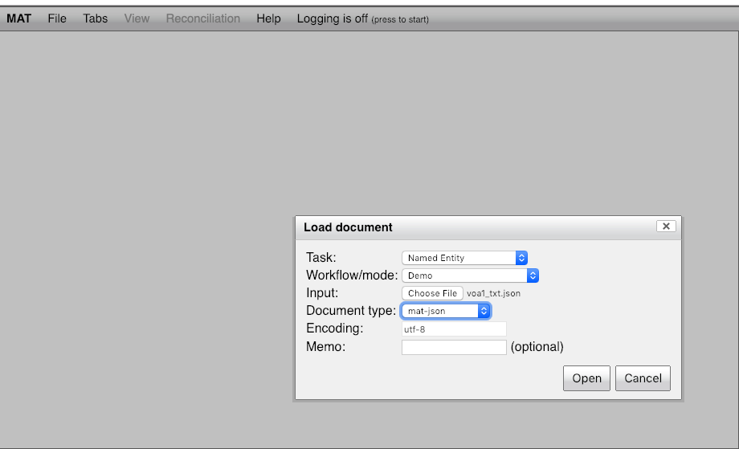

# MIST Demo
A demo of of [MIST: The MITRE Identification Scrubber Toolkit](http://mist-deid.sourceforge.net/current_docs/html/index.html).

## Dependencies
* [Vagrant 2.2.0](https://www.vagrantup.com/intro/getting-started/install.html)
* [Virtual Box 5.2.20](https://www.vagrantup.com/intro/getting-started/install.html)

## Running
* `vagrant up`
* Once vagrant finishes: 
    * The MIST UI will be running at [http://localhost:7801/MAT/workbench](http://localhost:7801/MAT/workbench)
    * One of the sample documents has been tagged (in `output`) and can be examined in the UI. To examine the tagged document visit the UI and load the document using the settings below:

  	
   

